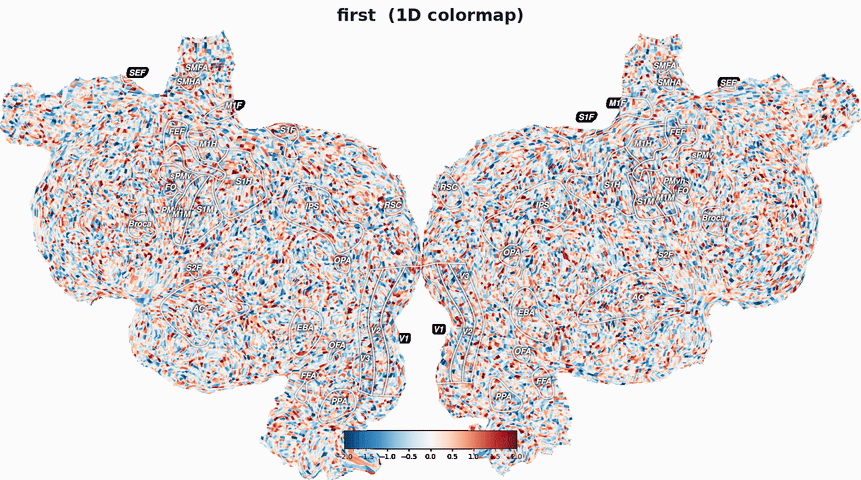

Overview: what pycortex is for
===============================

This page is the "start here." It explains the problem pycortex solves,
gives you a mental model of its main pieces and how data flows between
them, points you to the right page for whatever you're trying to do, and
ends with pointers to a working demo and the example gallery.

If a term below is unfamiliar, check the :doc:`glossary`.

The end goal: an interactive viewer, that can switch from folded, to inflated and flat surfaces
and that can display your data, ROIs and other anatomical data. Two
independent values per vertex can be shown separately with an ordinary 1D
colormap, or combined into one flatmap with a 2D colormap (see
:doc:`colormaps`) — cycling through all three below:

.. # TODO: update example with Mark's fake data version

Why Pycortex?
------------------------------------

FMRI data is a 3D grid of voxels, changing over time. Scrolling through 2D
slices makes it hard to build a mental map of activity across the whole,
deeply folded cortex, and "glass brain" projections that show everything
at once throw away exactly the location information you need to say
*where* on the cortex something happened. Rendering the data on a 3D surface mesh helps, 
but the usual approach can blur or misplace detail wherever the mesh's vertices happen 
to be sparse.
Pycortex instead uses **pixel-wise sampling** for a visibly crisper, more
faithful image.

Pycortex lets you move interactively between the folded,
inflated, and flattened views of the same surface, rather than being
stuck with one. Being able
to morph between them live allows you to reap benefits of all views.
You can build intuition for *where on the folded brain* a
feature on the flatmap actually lives while also seeing the whole cortex at once.

This reasoning is laid out in more technical depth in
the paper this software is built around:

    Gao JS, Huth AG, Lescroart MD and Gallant JL (2015). Pycortex: an
    interactive surface visualizer for fMRI. *Front. Neuroinform.* 9:23.
    doi: `10.3389/fninf.2015.00023 <https://doi.org/10.3389/fninf.2015.00023>`_

If you use pycortex in published work, please cite this paper (see the
citation on the :doc:`index` page).

The core mental model
----------------------

Pycortex treats functional data as a plain array with no built-in
anatomical meaning. A :term:`transform <xfm / transform>` records how one
particular scan's voxel grid lines up with a subject's own cortical
surface, and a :term:`mask` (see :ref:`database-masks`) narrows that
array down to the voxels near the cortex without ever modifying the data
itself. That's why Phase 1 below is about getting surfaces and a
transform into the :term:`filestore` — pycortex needs that mapping in
place before it can put your numbers on the right piece of cortex.

**Phase 1: one-time setup, per subject**

Pycortex is for taking a data array that you
have and displaying it, richly and interactively, on the
cortical surface. The setup phase exists purely to make that display
phase possible by getting a subject's surfaces and at
least one functional-to-anatomical transform into the pycortex
:term:`filestore` in the layout :doc:`database` expects. An example of this 
minimal layout is given in :ref:`minimal-filestore-contents`.

Every path below ends at the same place: surfaces + a transform in the filestore. 
The difference is how much of that already exists for you.

*I ran FreeSurfer's recon-all*

* **Surfaces**: You have raw surfaces. Import via ``cortex.freesurfer.import_subj``. 

* **Transform**: Compute a transforms with ``cortex.align.automatic``

*I ran fMRIPrep*

* **Surfaces**: You have raw surfaces. Import via ``cortex.freesurfer.import_subj``. If you used default locations, point cortex.freesurfer.import_subj at fMRIPrep's freesurfer/sub-<label> output directory 

* **Transform**: fMRIPrep already computed a transform for you

  * If you requested BOLD output in T1w space (--output-spaces T1w), your functional data already shares a grid with the anatomy. The transform is the identity matrix. 

  * If you're using native-space BOLD instead, fMRIPrep provides the alignment you need at anat/sub-<label>_from-T1w_to-fsnative_mode-image_xfm.txt.

*I have AFNI data*

AFNI's BRIK/HEAD volumes and alignment matrices aren't natively read by pycortex, 
so this path needs one conversion step before the usual flow applies:

* **Surfaces**: AFNI itself doesn't typically produce cortical surface reconstructions. Most AFNI users get surfaces via SUMA/FreeSurfer underneath.  If you have a FreeSurfer subject directory from that step, import it the normal way with ``cortex.freesurfer.import_subj``.

.. # TODO what if SUMA

* **Volume data**: BRIK/HEAD can be read directly with nibabel, so no custom parser is needed. Just make sure the resulting array + affine are passed into pycortex's Volume object as you would  any NIfTI-derived data.

* **Transform**: if you already have an alignment matrix from 3dAllineate or @auto_tlrc, convert it into a plain 4x4 array and load it the same way as any other transform (see Transform formats). Otherwise, run cortex.align.automatic against your EPI reference image as usual.

*I have BrainVoyager data*

BrainVoyager uses its own native mesh and volume formats, so this path needs format conversion before either surfaces or transforms can go into the filestore:

* **Surfaces**: BrainVoyager's .srf mesh files need to be converted into a format pycortex's importer reads (FreeSurfer binary or GIFTI) before running cortex.freesurfer.import_subj. 

.. code-block:: python

  import bvbabel
  import nibabel.freesurfer.io as fsio

  # 1. Read the BrainVoyager mesh
  header, vertices, faces = bvbabel.srf.read_srf("subject_cortex.srf")

  # 2. Write it out in FreeSurfer's binary surface format
  fsio.write_geometry("lh.pial", vertices, faces)

* **Volume data**: VMR/VTC files can be read with the bvbabel library; the resulting array and affine can then be used to build a pycortex Volume object as usual.

* **Transform**: BrainVoyager's .trf alignment files need to be converted to a plain 4x4 matrix before they can be loaded as a transform. As with AFNI, cortex.align.automatic remains an option if you'd rather compute the alignment directly from your EPI reference image instead of converting an existing one.

**Phase 2: every time you have data to look at (this is most of what
pycortex does)**

.. code-block:: text

    functional data (a voxel array) + a mask
            │  Combinethe subject + transform + mask to 
            |  create a :class:`cortex.Volume` or :class:`cortex.Vertex` object
            ▼
    cortex.Volume  or  cortex.Vertex
            │  (VolumeRGB / Volume2D and their Vertex counterparts, for
            │  precomputed colors or two or three jointly-colormapped quantities)
            │
            ├──► cortex.quickflat.make_figure / make_png / make_svg
            │        -> static flatmap image, with optional layers:
            │           ROI outlines & labels, sulci, curvature shading,
            │           dropout hatching, colorbar, cutouts — see
            │           :doc:`rois` and :doc:`colormaps`
            │
            └──► cortex.webgl.show / cortex.webgl.make_static
                     -> interactive viewer in a browser: drag between
                        folded/inflated/flattened, switch datasets and
                        colormaps live, draw ROIs/sulci in-browser (see
                        :doc:`roidraw`), save/restore viewpoints, play
                        back time-series data — see :doc:`userguide/webgl`

``cortex.quickshow`` is an alias for ``cortex.quickflat.make_figure``,
and ``cortex.webshow`` is an alias for ``cortex.webgl.show`` — both used
throughout the docs and examples. The Phase 2 options above are only a
summary; :doc:`auto_examples/index` has real, runnable code for most of
them. For a single script that runs this whole diagram top to bottom
using nothing but the bundled ``S1`` subject, see
:ref:`sphx_glr_auto_examples_quickstart_plot_pipeline_overview.py`.

**Phase 3: have fun exploring!**

Once the basics work, a good chunk of pycortex isn't about producing one
final figure — it's tools for poking at your data and your surfaces.
Some favorites from the gallery, each real and runnable:

.. * Compare several datasets side by side in one interactive viewer —
..   ``examples/webgl/multiple_datasets.py``.

* Do arithmetic directly on ``Volume``/``Vertex``/``Dataset`` objects —
  :ref:`sphx_glr_auto_examples_datasets_plot_dataset_arithmetic.py`.
* Measure distances or draw paths *along the folded cortical surface*
  rather than through 3D space —
  :ref:`sphx_glr_auto_examples_surface_analyses_plot_geodesic_distance.py`
  and
  :ref:`sphx_glr_auto_examples_surface_analyses_plot_geodesic_path.py`.
* Carve out and work with a reusable sub-patch of a surface —
  :ref:`sphx_glr_auto_examples_surface_analyses_plot_subsurfaces.py`.
* See exactly how much a flatmap distorts the brain, visualized as
  Tissot's indicatrix (equal-size circles on the folded surface, drawn
  on the flatmap to show where they stretch or shrink) —
  :ref:`sphx_glr_auto_examples_surface_analyses_plot_tissots_indicatrix.py`.
* Take full manual control over how flatmap layers are drawn and
  composited —
  :ref:`sphx_glr_auto_examples_quickflat_plot_advanced_compositing.py`.

:doc:`auto_examples/index` has plenty more — most examples are short and
meant to be copied and adapted directly rather than read end to end.

Which page do I need?
-----------------------

.. list-table::
   :header-rows: 1
   :widths: 45 55

   * - I want to...
     - Go to...
   * - Understand pycortex's vocabulary before reading further
     - :doc:`glossary`
   * - Turn a FreeSurfer subject into pycortex surfaces (segmentation,
       cutting, flattening)
     - :doc:`segmentation_guide`
   * - Understand what's stored in the filestore / browse an existing
       subject's data
     - :doc:`database`
   * - Register a functional scan to a subject's anatomy
     - :doc:`align` and :doc:`transforms`
   * - Define and use regions of interest
     - :doc:`rois` (SVG/Inkscape workflow) and :doc:`roidraw` (in-browser
       drawing add-on)
   * - Render a static 2D image of data on a flatmap
     - :doc:`api_reference_flat` (``cortex.quickflat``) and the
       :doc:`auto_examples/index`
   * - Get an interactive 3D/flat viewer
     - :doc:`userguide/webgl`
   * - Pick colors for 1D or 2D data
     - :doc:`colormaps`
   * - See real, runnable end-to-end code
     - :doc:`auto_examples/index`